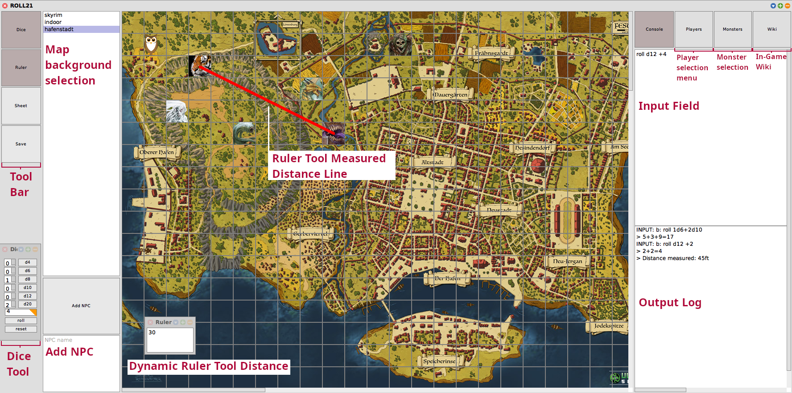

# TabletopUI
Welcome to the TabletopUI project!  
We are a team of 4th semester students studying IT-Systems Engineering at Hasso-Plattner-Institute and this is the first project including a Tabletop UI. It is part of a lecture in software engineering techniques (SWT).

## Installation
1. Get [Squeak 6.0 or later](http://www.squeak.org)
2. Add this repo via the Git Browser

## Screenshot


## Open
### Multiplayer only
To host execute these Commands:
`
relay := TTRelayServer new.
TTServer newOn: 'localhost' port: <server-port>.
`
The server port is shown in the morph that opens after creating the relay. Alternatively you can use `relay getServerPort`.
If the pc the server is running on is different from the pc the relay is running on, `'localhost'` has to be replaced by the ip of the relay's pc.
The players then can open the Tabletop UI with the command `TTTabletopWindow openSessionless`. A window will open offering different configuration options before starting a Tabletop game.

To close execute `relay kill.`
Only one server can be connected to a relay at a time.

## Main Functionalities
### Joining existing sessions
After a server is created you can connect to it by entering the ip of the relay's pc and the client port.
Choose a name and a role and play with your friends.

### Select Roles
You can select the desired role by entering its name in the starting screen.  
There are certain functions only available to the gamemaster.

### Chat
You can use the input Field for commands to chat with the other players.
Your commands will also be synchronised and seen by the other players.

### Rolling the dice
Every player including the gamemaster can execute a dice roll.
To do so, you can use the dice tool which can be found on the left of the screen.
Alternatively you can roll the dice via the input prompt on the bottom right.
The dice command is ```roll dx```. x represents the maximum number of eyes the rolled dice can show. Valid dice sizes are 4, 6, 8, 10, 12 and 20.  
In the dice command a number y can be added or subtracted to the dice result. This is done by ```roll dx[+|-]y```.  
It is also possible to roll z dices at once using the command ```roll zdx```.  
You can also combine modifiers and multiple dice rolls like this: ```roll zdx[+|-]y``` or roll different dice types by combining them with + or -.

### Fight Mode
The gamemaster can choose to begin an initiative roll. The command to start an initiative roll is ```start fight```, ```start initiative``` or ```start ini```.  
After this command, all players except the gamemaster may now roll a dice to determine their fight position. Not all players have to roll the dice. The gamemaster ends the dice roll round with ``end initiative`` or ``end ini``.  
Now, the fight begins and the turnorder appears as a pop up list. 
A player can roll the dice as often as he/she wants to and ends its turn manually by typing "end turn".
At any time the gamemaster can remove players from the fight via the command ```remove [playername]```.  
To end the fight and return to the default mode the gamemaster can use ```end fight```.

### Add NPCs
The gamemaster can  add NPCs during the entire game through the side bar. To do this, a valid name must be entered in the provided input field and then the "Add NPC" button must be pressed.

### Add Maps
The gamemaster can add a new Map. To do this the gamemaster presses on the Add Map button and selects a jpg or png. The image will then be sent to the players and appear in the map selection list. If the gamemaster then selects the iamge every player will switch to that map.

### Measure distances
To measure distances on the map you can use the ruler tool on the left of the screen.
A new window displaying the distance will open.
If you want to measure the distance between two tiles simply drag your cursor between them.
The distance will also be displayed in the log.

### Character Sheet
Select Sheet on the left of the screen to open a Character Sheet.
It shows the all relevant attributes of the current player and allows you to edit them.
If you click the label of an attribute a corresponding modiefier will be added to a dice roll.
